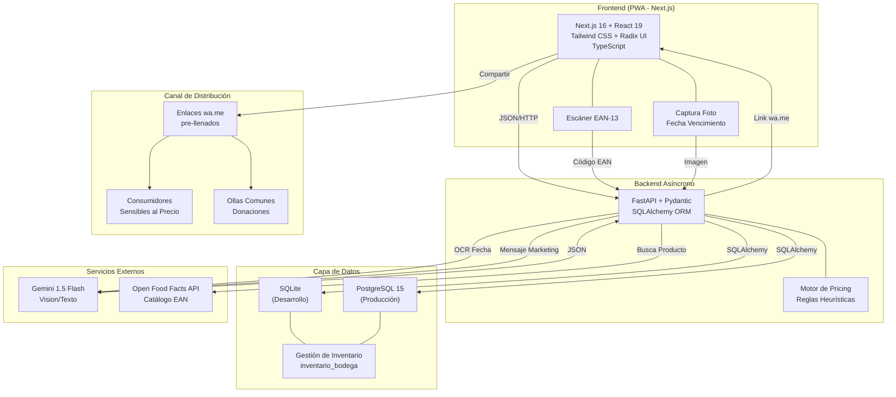

# 🛒 AppMermas - MVP (Optimización de Mermas Comerciales)

Es una Plataforma de Economía Circular diseñada para pymes (minimarkets) de los distritos de Lima. Optimiza la liquidación de inventario perecedero a través de estrategias de descuentos dinámicos (heurística) y facilita un canal de salida de fricción cero mediante enlaces profundos de WhatsApp (`wa.me`).

## 🏗️ Arquitectura Técnica

El proyecto está construido bajo una arquitectura orientada a servicios (API-First):

**Frontend Stack:**
- **Framework:** Next.js 16.2.0 (App Router)
- **Librería UI:** React 19.2.4 + Radix UI + shadcn/ui
- **Estilos:** Tailwind CSS 4.2.0 + PostCSS
- **Lenguaje:** TypeScript 5.7.3
- **Formularios:** React Hook Form + Zod (validación)
- **Componentes:** lucide-react (iconos), Sonner (toasts), Embla Carousel

**Backend Stack:**
- **Framework:** FastAPI (Python)
- **ORM:** SQLAlchemy 2.0
- **Validación:** Pydantic v2
- **Base de Datos:** SQLite (desarrollo) / PostgreSQL (producción via Docker)
- **Servidor:** Uvicorn

**Integraciones:**
- Simulación de OCR multimodal (Gemini 1.5 Flash mock)
- Integración con API nativa de WhatsApp (`wa.me` links)
- Open Food Facts API (catálogo de productos)

## 🚀 Guía de Instalación y Ejecución Local

Para probar el flujo completo (Frontend + Backend), ejecuta los pasos en **dos terminales separadas**:

### Opción A: Ejecución Local (Recomendado para desarrollo)

#### Terminal 1: Levantar el Backend (FastAPI)

```bash
# 1. Navega a la carpeta backend
cd backend

# 2. Crear entorno virtual (si no existe)
python -m venv venv

# 3. Activar el entorno virtual
# En Windows:
venv\Scripts\activate
# En Mac/Linux:
source venv/bin/activate

# 4. Instalar dependencias
pip install -r requirements.txt

# 5. Iniciar el servidor (Accesible en la red local)
uvicorn app.main:app --host 0.0.0.0 --port 8000 --reload
```

**Backend estará disponible en:** `http://localhost:8000`
**Docs interactivas:** `http://localhost:8000/docs`

#### Terminal 2: Levantar el Frontend (Next.js)

```bash
# 1. Navega a la raíz del proyecto
cd ..

# 2. Instalar dependencias (si no las tienes)
pnpm install
# O con npm:
npm install

# 3. Iniciar servidor de desarrollo
pnpm dev
# O con npm:
npm run dev
```

**Frontend estará disponible en:** `http://localhost:3000`

---

### Opción B: Ejecución con Docker Compose (Producción)

Si tienes **Docker** instalado, puedes usar la configuración completa:

```bash
cd backend
docker compose up -d
```

Esto levantará:
- **Backend FastAPI:** `http://localhost:8000`
- **PostgreSQL:** `localhost:5432` (usuario: postgres, sin contraseña en desarrollo)

> **Nota:** El Frontend sigue en `pnpm dev` (no está containerizado). Para producción, usa `pnpm build && pnpm start`

---

### Variables de Entorno

Crea un archivo `.env.local` en la raíz del proyecto para el frontend (si es necesario):

```env
NEXT_PUBLIC_API_URL=http://localhost:8000
```

Para el backend, las variables están en `backend/docker-compose.yml`


## 🏛️ Arquitectura de Sistema



---

## 📁 Estructura del Proyecto

```
appmermas/
├── app/                          # Frontend (Next.js App Router)
│   ├── layout.tsx               # Layout raíz
│   ├── page.tsx                 # Página principal
│   └── globals.css              # Estilos globales
├── components/                   # Componentes React reutilizables
│   ├── header.tsx               # Encabezado
│   ├── scan-section.tsx         # Sección escáner EAN-13
│   ├── result-card.tsx          # Tarjeta de resultados
│   ├── share-section.tsx        # Sección compartir (WhatsApp)
│   └── ui/                      # Componentes shadcn/ui (Radix)
├── hooks/                        # Custom React hooks
│   ├── use-mobile.ts            # Hook para detectar móvil
│   └── use-toast.ts             # Hook para toasts
├── lib/                          # Utilidades
│   └── utils.ts                 # Funciones auxiliares
├── styles/                       # Estilos CSS
├── backend/                      # Backend (FastAPI)
│   ├── app/
│   │   ├── main.py             # Entrada del servidor FastAPI
│   │   ├── models.py           # Modelos SQLAlchemy
│   │   ├── schemas.py          # Esquemas Pydantic
│   │   └── database.py         # Configuración BD
│   ├── docker-compose.yml      # Orquestación (PostgreSQL + FastAPI)
│   └── requirements.txt        # Dependencias Python
├── public/                       # Archivos estáticos
├── package.json                 # Dependencias Node.js
├── tsconfig.json               # Configuración TypeScript
├── next.config.mjs             # Configuración Next.js
└── README.md                   # Este archivo
```

---

## 🔌 API Endpoints Principales

**Base URL:** `http://localhost:8000` (Desarrollo)

| Método | Endpoint | Descripción |
|--------|----------|-------------|
| `POST` | `/api/inventario/` | Registra un producto en el inventario |
| `POST` | `/api/ia/extraer-fecha` | Extrae fecha de vencimiento (mock OCR) |
| `GET` | `/docs` | Documentación interactiva Swagger |
| `GET` | `/openapi.json` | Especificación OpenAPI |

### Ejemplo: Registrar Producto

```bash
curl -X POST "http://localhost:8000/api/inventario/" \
  -H "Content-Type: application/json" \
  -d '{
    "ean_13": "7501234567890",
    "nombre_si_nuevo": "Yogur Natural",
    "categoria_si_nuevo": "Lácteos",
    "fecha_vencimiento": "2026-05-10",
    "cantidad": 5,
    "precio_base": 12.50
  }'
```

---

## 📦 Scripts Disponibles

### Frontend (Next.js)

```bash
pnpm dev       # Inicia servidor de desarrollo (localhost:3000)
pnpm build     # Compila para producción
pnpm start     # Inicia servidor de producción
pnpm lint      # Ejecuta ESLint
```

### Backend (FastAPI)

```bash
# Desarrollo
uvicorn app.main:app --reload --host 0.0.0.0 --port 8000

# Producción
uvicorn app.main:app --host 0.0.0.0 --port 8000

# Con Docker
docker compose up -d      # Levanta PostgreSQL + Backend
docker compose down       # Detiene contenedores
```

---

## 🔧 Troubleshooting

### ❌ **"Connection refused" en Backend**

**Problema:** El frontend no puede conectar con el backend en `localhost:8000`

**Solución:**
1. Verifica que el backend esté corriendo: `http://localhost:8000/docs`
2. En `next.config.mjs`, asegúrate que `allowedDevOrigins` incluya tu IP local
3. Revisa que CORS esté habilitado en `backend/app/main.py`

---

### ❌ **"Port 3000 already in use"**

**Problema:** Next.js no puede usar el puerto 3000

**Solución:**
```bash
# Usa otro puerto
pnpm dev -- -p 3001

# O mata el proceso anterior
lsof -i :3000        # En Mac/Linux
Get-Process -Name node | Stop-Process  # En Windows
```

---

### ❌ **Base de datos no persiste**

**Problema:** Los datos desaparecen cuando reinicio

**Solución:** Asegúrate que `backend/app/database.py` use:

```python
# Para desarrollo con SQLite (persiste en bioshare.db)
SQLALCHEMY_DATABASE_URL = "sqlite:///./bioshare.db"

# Para producción con PostgreSQL (usa Docker Compose)
SQLALCHEMY_DATABASE_URL = "postgresql://..."
```

---

### ❌ **Error "ModuleNotFoundError" en Backend**

**Problema:** FastAPI no encuentra módulos Python

**Solución:**
```bash
cd backend
pip install -r requirements.txt  # Reinstala dependencias
```

---

## 🚀 Deploy

### Frontend (Vercel)

```bash
# Conecta tu repo a Vercel en https://vercel.com
# O deploy manual:
pnpm build
vercel deploy --prod
```

### Backend (Railway / Render)

1. Crea account en [Railway.app](https://railway.app) o [Render.com](https://render.com)
2. Conecta tu repositorio
3. Establece variables de entorno:
   - `DATABASE_URL`: URL de PostgreSQL
4. Deploy automático en cada push

---

## 👥 Contribución

Las contribuciones son bienvenidas. Por favor:

1. Fork el repositorio
2. Crea una rama: `git checkout -b feature/tu-feature`
3. Commit cambios: `git commit -m "Add tu-feature"`
4. Push: `git push origin feature/tu-feature`
5. Abre un Pull Request

---

## 📄 Licencia

Este proyecto está bajo licencia **MIT**. Ver `LICENSE` para más detalles.

---

## 📞 Contacto & Soporte

- **Issues:** Usa GitHub Issues para reportar bugs
- **Discussions:** Para preguntas y sugerencias
- **Email:** asdasdasd

---

**Última actualización:**  6 de Mayo 2026 | Versión: 0.1.0 (MVP)
